# Flujo Operativo Detallado: Factoring (Originación a Liquidación)

Este diagrama detalla los pasos del proceso, identificando al **USUARIO** responsable de cada etapa y los **INPUTS** necesarios para avanzar.

```mermaid
graph TD
    %% Estilos
    classDef usuarioOp fill:#e1f5fe,stroke:#01579b,stroke-width:2px;
    classDef usuarioGer fill:#fff9c4,stroke:#fbc02d,stroke-width:2px;
    classDef usuarioTes fill:#e8f5e9,stroke:#2e7d32,stroke-width:2px;
    classDef usuarioCob fill:#f3e5f5,stroke:#7b1fa2,stroke-width:2px;

    %% --- ETAPA 1: ORIGINACIÓN ---
    subgraph ORIGINACION [Módulo Originación]
        direction TB
        N1("<b>Paso 1: Carga y Cálculo</b><br>User: Analista Operaciones"):::usuarioOp
        N2("<b>Paso 2: Generación Documental</b><br>User: Analista Operaciones"):::usuarioOp
    end

    %% --- ETAPA 2: APROBACIÓN ---
    subgraph APROBACION [Módulo Aprobación]
        direction TB
        N3("<b>Paso 3: Revisión Gerencial</b><br>User: Gerencia"):::usuarioGer
    end

    %% --- ETAPA 3: DESEMBOLSO ---
    subgraph DESEMBOLSO [Módulo Desembolso]
        direction TB
        N4("<b>Paso 4: Formalización del Desembolso</b><br>User: Tesorería"):::usuarioTes
    end

    %% --- ETAPA 4: LIQUIDACIÓN ---
    subgraph LIQUIDACION [Módulo Liquidación]
        direction TB
        N5("<b>Paso 5: Recepción de Pago</b><br>User: Operaciones/Cobranza"):::usuarioCob
        N6("<b>Paso 6: Liquidación Final</b><br>User: Operaciones/Cobranza"):::usuarioCob
    end

    %% FLUJO
    Start((Inicio)) -->|"Input: Facturas XML/PDF + Tasas"| N1
    
    N1 -->|"Input: Selección de Cliente y Condiciones"| N2
    
    N2 -->|"Input: Confirmación de Guardado (Data en BD)"| N3
    
    N3 -->|"Input: Clic en 'Aprobar' (Visto Bueno)"| N4
    
    N4 -->|"Input: Voucher de Transferencia (PDF) + Fecha"| N5
    
    N5 -->|"Input: Comprobante de Pago del Cliente + Fecha Real"| N6
    
    N6 -->|"Input: Confirmación de Cierre"| End((Fin del Proceso))

    %% Leyenda de Colores
    %% Azul: Analista
    %% Amarillo: Gerencia
    %% Verde: Tesorería
    %% Morado: Cobranza
```

## Descripción de Roles

*   **Analista Operaciones (Azul):** Encargado de ingresar la información inicial, procesar las facturas y generar los contratos.
*   **Gerencia (Amarillo):** Responsable de validar la rentabilidad y riesgo de la operación antes de soltar el dinero.
*   **Tesorería (Verde):** Ejecuta la transferencia bancaria al cliente y registra la salida de dinero.
*   **Operaciones/Cobranza (Morado):** Gestiona la cobranza final, verifica los pagos recibidos y cierra la operación calculando intereses finales.
