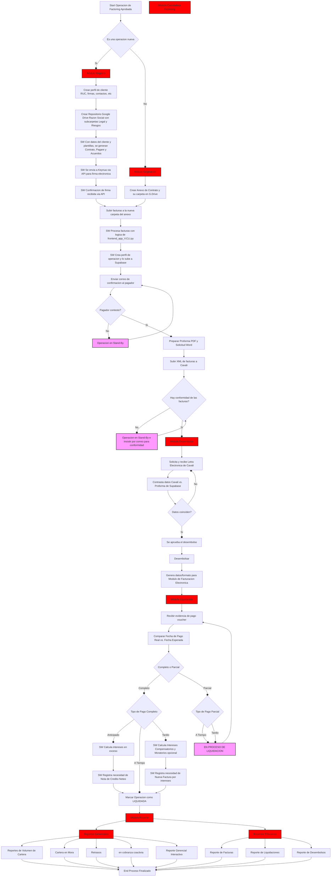

```mermaid
graph TD
    A["Start Operacion de Factoring Aprobada"] --> B{Es una operacion nueva};

    B --o|Si| SW_MODULO_CLIENTES["Módulo Registro"];
    SW_MODULO_CLIENTES --> SW_PASO_1["Crear perfil de cliente RUC, firmas, contactos, etc"];
    SW_PASO_1 --> SW_PASO_2["Crear Repositorio Google Drive Razon Social con subcarpetas Legal y Riesgos"];
    SW_PASO_2 --> SW_GEN_DOCS["SW Con datos del cliente y plantillas, se generan Contrato, Pagare y Acuerdos"];
    SW_GEN_DOCS --> SW_SEND_KEYNUA["SW Se envia a Keynua via API para firma electronica"];
    SW_SEND_KEYNUA --> SW_KEYNUA_CONFIRM["SW Confirmacion de firma recibida via API"];
    SW_KEYNUA_CONFIRM --> K;

    B --o|No| SW_MODULO_OPERACIONES["Módulo Originación"];
    SW_MODULO_OPERACIONES --> SW_CREAR_ANEXO["Crear Anexo de Contrato y su carpeta en G.Drive"];
    SW_CREAR_ANEXO --> K;

    K["Subir facturas a la nueva carpeta del anexo"] --> SW_PROCESAR_FACTURAS["SW Procesa facturas con logica de frontend_app_V.CLI.py"];
    SW_PROCESAR_FACTURAS --> SW_CREAR_PERFIL_OP["SW Crea perfil de operacion y lo sube a Supabase"];
    SW_CREAR_PERFIL_OP --> L["Enviar correo de confirmacion al pagador"];
    L --> M{Pagador contesto?};
    M --o|No| N_STANDBY["Operacion en Stand-By"];
    N_STANDBY --> L;
    M --o|Si| O["Preparar Proforma PDF y Solicitud Word"];

    O --> P["Subir XML de facturas a Cavali"];
    P --> Q{Hay conformidad de las facturas?};
    Q --o|No| R_STANDBY["Operacion en Stand-By e Insistir por correo para conformidad"];
    R_STANDBY --> Q;

    Q --o|Si| SW_MODULO_DESEMBOLSO["Módulo Desembolso"];
    SW_MODULO_DESEMBOLSO --> SW_GET_CAVALI["Solicita y recibe Letra Electronica de Cavali"];
    SW_GET_CAVALI --> SW_CONTRASTE["Contrasta datos Cavali vs. Proforma de Supabase"];
    SW_CONTRASTE --> VERIFICACION{Datos coinciden?};
    VERIFICACION --o|No| SW_GET_CAVALI;
    VERIFICACION --o|Si| SW_APROBACION["Se aprueba el desembolso"];
    SW_APROBACION --> T["Desembolsar"];
    T --> SW_FACTURACION["Genera datos/formato para Modulo de Facturacion Electronica"];

    SW_FACTURACION --> SW_MODULO_LIQUIDACION["Módulo Liquidación"];
    SW_MODULO_LIQUIDACION --> SW_RECEPCION_PAGO["Recibir evidencia de pago voucher"];
    SW_RECEPCION_PAGO --> SW_COMPARAR_FECHAS["Comparar Fecha de Pago Real vs. Fecha Esperada"];
    SW_COMPARAR_FECHAS --> TIPO_PAGO{Completo o Parcial};

    TIPO_PAGO --o|Completo| TIPO_PAGO_COMPLETO{Tipo de Pago Completo};
    TIPO_PAGO_COMPLETO --o|Anticipado| SW_PAGO_ANTICIPADO["SW Calcula intereses en exceso"];
    SW_PAGO_ANTICIPADO --> SW_GEN_NC["SW Registra necesidad de Nota de Credito Neteo"];
    SW_GEN_NC --> CIERRE_FINAL;
    TIPO_PAGO_COMPLETO --o|A Tiempo| CIERRE_FINAL;
    TIPO_PAGO_COMPLETO --o|Tardio| SW_PAGO_TARDIO["SW Calcula Intereses Compensatorios y Moratorios opcional"];
    SW_PAGO_TARDIO --> SW_GEN_FACTURA["SW Registra necesidad de Nueva Factura por intereses"];
    SW_GEN_FACTURA --> CIERRE_FINAL;

    TIPO_PAGO --o|Parcial| TIPO_PAGO_PARCIAL{Tipo de Pago Parcial};
    TIPO_PAGO_PARCIAL --o|A Tiempo| EN_PROCESO_LIQUIDACION["EN PROCESO DE LIQUIDACION"];
    TIPO_PAGO_PARCIAL --o|Tardio| EN_PROCESO_LIQUIDACION;
    EN_PROCESO_LIQUIDACION --> SW_RECEPCION_PAGO;

    CIERRE_FINAL["Marcar Operacion como LIQUIDADA"] --> MODULO_REPORTE["Módulo Reporte"];
    MODULO_REPORTE --> REPORTES_GERENCIALES["Reportes Gerenciales"];
    MODULO_REPORTE --> REPORTES_TRIBUTARIOS["Reportes Tributarios"];

    REPORTES_GERENCIALES --> REPORTE_VOLUMEN_CARTERA["Reportes de Volumen de Cartera"];
    REPORTES_GERENCIALES --> CARTERA_MORA["Cartera en Mora"];
    REPORTES_GERENCIALES --> RETRASOS["Retrasos"];
    REPORTES_GERENCIALES --> COBRANZA_COACTIVA["en cobranza coactivia"];
    REPORTES_GERENCIALES --> REPORTE_GERENCIAL_INTERACTIVO["Reporte Gerencial Interactivo"];

    REPORTES_TRIBUTARIOS --> REPORTE_FACTURAS["Reporte de Facturas"];
    REPORTES_TRIBUTARIOS --> REPORTE_LIQUIDACIONES["Reporte de Liquidaciones"];
    REPORTES_TRIBUTARIOS --> REPORTE_DESEMBOLSOS["Reporte de Desembolsos"];

    REPORTE_VOLUMEN_CARTERA --> Z;
    CARTERA_MORA --> Z;
    RETRASOS --> Z;
    COBRANZA_COACTIVA --> Z;
    REPORTE_GERENCIAL_INTERACTIVO --> Z;
    REPORTE_FACTURAS --> Z;
    REPORTE_LIQUIDACIONES --> Z;
    REPORTE_DESEMBOLSOS --> Z;
    Z["End Proceso Finalizado"];

    SW_CALCULADORA_FACTORING["Módulo Calculadora Factoring"];

    classDef standby fill:#f9f,stroke:#333,stroke-width:2px
    classDef module fill:#ff0000,stroke:#333,stroke-width:2px

    class N_STANDBY,R_STANDBY,H_STANDBY,EN_PROCESO_LIQUIDACION standby
    class SW_MODULO_CLIENTES,SW_MODULO_OPERACIONES,SW_MODULO_DESEMBOLSO,SW_MODULO_LIQUIDACION,MODULO_REPORTE,REPORTES_GERENCIALES,REPORTES_TRIBUTARIOS,SW_CALCULADORA_FACTORING module
```
