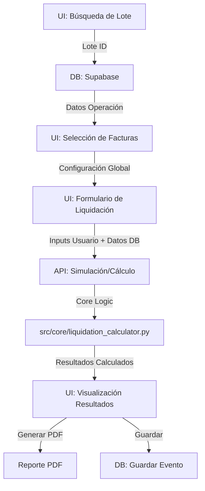

# Mapa de Variables: Módulo de Liquidación

Este documento detalla el flujo de datos y las variables clave utilizadas en el módulo de Liquidación del Mini ERP v2.

## 1. Flujo de Datos General



## 2. Entradas (Inputs)

### Desde la Base de Datos (`datos_operacion`)
Estos datos provienen de la propuesta/operación original almacenada en Supabase.

| Variable | Descripción | Origen |
| :--- | :--- | :--- |
| `fecha_pago_calculada` | Fecha esperada de pago según la operación original. | DB (Propuesta) |
| `capital_calculado` | Monto del capital desembolsado. | DB (Propuesta) |
| `interes_calculado` | Monto del interés original calculado. | DB (Propuesta) |
| `plazo_operacion_calculado` | Días de plazo original. | DB (Propuesta) |
| `interes_mensual` | Tasa de interés mensual original (%). | DB (Propuesta) |

### Desde la Interfaz de Usuario (UI)
Variables configuradas por el usuario en `pages/03_Liquidaciones.py`.

| Variable | Descripción | Default / Notas |
| :--- | :--- | :--- |
| `fecha_pago_real_str` | Fecha en que se realizó el pago efectivo. | `datetime.date.today()` |
| `monto_recibido` | Monto total pagado por el cliente. | `monto_neto_factura` (editable) |
| `tasa_interes_compensatoria_pct` | Tasa mensual de interés compensatorio. | `interes_mensual` original |
| `tasa_interes_moratoria_pct` | Tasa mensual de interés moratorio. | Configurable (Global: `tasa_mora_anual` / 12) |

## 3. Variables del Núcleo de Cálculo (`calcular_liquidacion`)

Ubicación: `src/core/liquidation_calculator.py`

### Variables Intermedias

| Variable | Fórmula / Lógica | Descripción |
| :--- | :--- | :--- |
| `dias_diferencia` | `fecha_pago_real - fecha_pago_esperada` | Días de atraso (+) o anticipación (-). |
| `diferencia_monto_pago` | `capital_desembolsado - monto_recibido` | Diferencia entre lo debido y lo pagado. |
| `tasa_diaria_compensatoria` | `(tasa_comp_pct / 100) / 30` | Tasa diaria para interés compensatorio. |
| `tasa_diaria_moratoria` | `(tasa_mora_pct / 100) / 30` | Tasa diaria para interés moratorio. |
| `tasa_diaria_original` | `(interes_mensual_pct / 100) / 30` | Tasa diaria original (para devoluciones). |

### Cálculo de Cargos (Pago Tardío: `dias_diferencia > 0`)

| Variable | Fórmula Simplificada | Descripción |
| :--- | :--- | :--- |
| `interes_compensatorio_final_calc` | `Capital * ((1 + TasaDiariaComp)^Dias - 1)` | Interés por el uso del dinero en días extra. |
| `interes_moratorio_final_calc` | `Capital * ((1 + TasaDiariaMora)^Dias - 1)` | Penalidad por mora. |
| `igv_...` | `Interes * 0.18` | IGV aplicable a los intereses. |

### Cálculo de Créditos (Pago Anticipado: `dias_diferencia < 0`)

| Variable | Fórmula Simplificada | Descripción |
| :--- | :--- | :--- |
| `dias_anticipacion` | `abs(dias_diferencia)` | Días pagados antes de tiempo. |
| `plazo_real` | `plazo_original - dias_anticipacion` | Nuevo plazo efectivo. |
| `interes_real_calculado` | `Capital * ((1 + TasaOrig)^PlazoReal - 1)` | Interés que debió cobrarse. |
| `interes_a_devolver_final_calc` | `InteresOriginal - InteresReal` | Monto a devolver al cliente. |

### Saldo Final

| Variable | Fórmula | Descripción |
| :--- | :--- | :--- |
| `total_owed_before_payment` | `Capital + Int.Comp + Int.Mora + IGVs` | Total deuda acumulada a la fecha de pago. |
| `saldo_final` | `total_owed_before_payment - monto_recibido` | Saldo restante (si > 0) o excedente (si < 0). |

## 4. Salidas (Outputs)

El resultado es un diccionario JSON estructurado:

```json
{
    "parametros_calculo": { ... }, // Valores base usados
    "dias_diferencia": int,
    "tipo_pago": "Tardío" | "Anticipado" | "A Tiempo",
    "cargo_por_diferencia": float, // Capital no pagado
    "credito_por_diferencia": float, // Excedente de capital
    "desglose_cargos": {
        "interes_compensatorio": float,
        "igv_interes_compensatorio": float,
        "interes_moratorio": float,
        "igv_interes_moratorio": float,
        "total_cargos": float
    },
    "desglose_creditos": {
        "interes_a_devolver": float,
        "igv_interes_a_devolver": float,
        "total_creditos": float
    },
    "liquidacion_final": {
        "saldo_final_a_liquidar": float
    }
}
```

## 5. Notas Adicionales

- **Precisión**: Se usa `Decimal` con precisión de 30 dígitos para los cálculos internos para evitar errores de punto flotante, pero se convierte a `float` para la salida JSON (UI).
- **Proyección**: Si queda saldo pendiente (`saldo_final > 0`), se utiliza la función `proyectar_saldo_diario` para mostrar cómo crecerá la deuda en el futuro.
